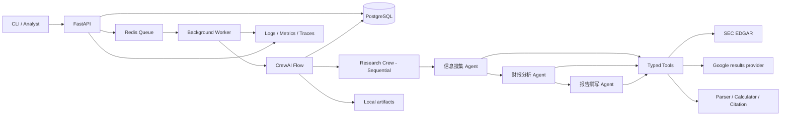

# 技术架构与技术栈

## 1. 架构结论

采用“FastAPI + 后台 Worker + CrewAI Flow/Crew + PostgreSQL + Redis + 本地工件存储”的模块化单体。MVP 不拆微服务：模块边界清楚，但共用一个代码仓库和数据库，以控制学习成本。最终交付使用 Docker Compose 在本地启动 API、Worker、PostgreSQL、Redis 和可观测性组件，不依赖 Azure 或其他付费云平台。

CrewAI 的职责边界：

- `Crew` + `Process.sequential`：完成三个 Agent 的顺序任务协作。
- `Flow`：管理任务状态、条件分支、失败恢复、质量门禁与 Crew 调用。
- Python 服务代码：输入校验、外部 API、缓存、公式计算、持久化、重试和安全控制。

## 2. 总体架构



## 3. Agent 设计

| Agent | 目标 | 可用工具 | 结构化输出 | 禁止事项 |
|---|---|---|---|---|
| 信息搜集 Agent | 形成覆盖充分、去重、带时间边界的 source pack | 公司解析、Google 搜索、SEC submissions、SEC facts、文件下载 | `ResearchPack` | 不引用未访问页面；不写财务结论；不绕过 `as_of_date` |
| 财报分析 Agent | 选择可比期间和事实，调用计算工具，解释趋势与异常 | 文档解析、事实查询、指标计算、工件读取 | `FinancialAnalysisPack` | 不自行心算；不改变原始事实；不可计算时不得填数 |
| 报告撰写 Agent | 把前两步内容写成清晰、审慎、带引用的报告初稿 | 工件读取、引用检查、模板渲染 | `ReportDraft` | 不引入上下文之外的新事实；不输出买卖建议；不隐藏数据限制 |

为满足题目要求，系统保留三个核心 Agent。质量校验使用确定性代码和 guardrail，而不是增加一个会带来新不确定性的“审核 Agent”。后续可以把 LLM 审核作为辅助评分器，但不能替代硬校验。

**Phase 3.5 补充（受控反思与修订闭环）**：质量门禁输出结构化质量问题（`QualityIssue`），由 `flows/ReflectionController`（P03-20）路由到「发布 / 定向修订（Writer，≤1 次）/ 补证（Research，≤1 次后重走 Analysis+Writer）/ 拒绝」——所有循环由 Flow 控制，**Agent 之间不直接调用**（对齐 ADR-001）。新的类型化契约（`RevisionRequest`、`SupplementResearchRequest` 等）落在 `domain/` 或 `flows/` 层（P03-16 起），不增加第四个审核 Agent。

## 4. 工具设计（至少 5 个，实际规划 9 个）

所有工具都必须有 Pydantic 输入/输出、超时、错误分类、重试策略、脱敏日志和契约测试。

| 工具 | 职责 | 主要输出 | 降级策略 |
|---|---|---|---|
| `CompanyResolverTool` | 名称/ticker → CIK 与公司元数据 | `CompanyIdentity` | 返回候选交给用户，不猜测 |
| `GoogleSearchTool` | 获取 Google 搜索结果 | `SearchResult[]` | Serper 主通道；可配置备用搜索提供商 |
| `SECSubmissionsTool` | 获取申报历史与 10-K/10-Q 元数据 | `FilingMetadata[]` | 缓存；延迟后重试 |
| `SECCompanyFactsTool` | 获取 XBRL Company Facts | `FinancialFact[]` | 缓存；必要时从申报 XBRL 补充 |
| `FilingDownloaderTool` | 下载 HTML/PDF/附件并校验 | `DownloadedDocument` | HTML 主文档优先，PDF/文本附件备用 |
| `DocumentParserTool` | 解析 HTML/PDF、保留页码与章节 | `ParsedDocument` | Docling → PyMuPDF/BeautifulSoup |
| `FinancialCalculatorTool` | 确定性计算和公式校验 | `MetricResult[]` | 不可计算时返回原因和缺失输入 |
| `ArtifactStoreTool` | 原子写入、读取、列出中间工件 | `ArtifactRef` | 本地原子写入；失败时不发布 |
| `CitationVerifierTool` | 验证 claim、locator 与 source 映射 | `CitationCheckResult` | 失败阻止最终发布或标记 partial |

“Google Search”建议通过返回 Google 结果的 API 提供商实现，避免让 Agent 直接抓取 Google 页面。提供商必须封装在接口后面，业务代码不得依赖某一家响应结构。

## 5. 推荐技术栈

| 层 | 当前项目技术选型 | 选择原因 |
|---|---|---|
| 语言与依赖 | Python 3.12、`uv` | 类型生态和启动速度适合 AI 工程项目 |
| API | FastAPI、Pydantic v2 | 已有学习基础，自动 schema 与 async 支持好 |
| Multi-Agent | CrewAI 1.x，Crew + Flow | 满足项目要求，支持顺序任务、结构化输出和 guardrail |
| LLM | DeepSeek，OpenAI-compatible endpoint | Cline 与运行时统一生态，但解耦具体模型名 |
| 数据访问 | SQLAlchemy 2、Alembic、psycopg 3 | 显式事务、异步访问与迁移工具成熟 |
| 主数据库 | PostgreSQL 16，本地 Docker volume 持久化 | 关系数据、JSONB、全文与向量扩展可统一承载 |
| 向量检索 | pgvector + BGE-M3（P2） | MVP 可暂缓，避免一开始引入 Milvus 运维负担 |
| 缓存/队列 | Redis 7 + Celery 5 | 缓存、限流、后台任务和重试生态成熟 |
| HTTP | httpx | async、超时和连接池支持清晰 |
| 重试 | Tenacity + 自定义错误分类 | 指数退避、抖动和可测试策略 |
| 文档 | BeautifulSoup/lxml、Docling、PyMuPDF | SEC HTML 优先，PDF 多级降级 |
| 数值 | `decimal.Decimal`、pandas | 金额/比例计算避免二进制浮点误差 |
| 报告 | legacy 走 Jinja2 Markdown；**年度走自包含 raw 发布**（`annual_report_renderer.py`） | 年度报告含官方声明中英对照、MD&A 中文摘译、正文引用纯文本、来源清单可点击，直接发布不重复套模板 |
| 测试 | pytest、pytest-asyncio、respx、testcontainers | 外部 API 可录制/Mock，数据库可集成测试 |
| 可观测性 | structlog、Prometheus、Grafana、OpenTelemetry | API 单进程 + Worker 多进程（`PROMETHEUS_MULTIPROC_DIR` 真实 env）；WS3 成本指标（token/工具/成本）+ Grafana 8 行看板 + Jaeger 链路 |
| 部署 | Docker Compose | 免费、本地可复现，适合作品集演示 |

具体依赖版本在项目初始化当天通过官方兼容矩阵选择并锁定到 `uv.lock`。文档只约束主版本和能力，不把未来已经过期的小版本写死。

## 6. 代码目录建议

```text
.
├── src/invest_research/
│   ├── api/                  # FastAPI 路由、请求/响应 DTO
│   ├── application/          # 用例、job service、workflow service
│   ├── domain/               # 实体、值对象、状态、错误码
│   ├── agents/               # CrewAI agent/task/crew 配置
│   ├── flows/                # CrewAI Flow 与状态模型
│   ├── tools/                # typed tool adapters
│   ├── financial/            # concept mapping、期间选择、公式
│   ├── infrastructure/
│   │   ├── db/               # SQLAlchemy、repositories
│   │   ├── cache/            # Redis
│   │   ├── queue/            # Celery
│   │   ├── storage/          # 本地工件存储
│   │   └── observability/    # logging、metrics、tracing
│   ├── prompts/              # 运行时 Agent 提示词，带版本
│   └── settings.py
├── tests/
│   ├── unit/
│   ├── integration/
│   ├── contract/
│   ├── e2e/
│   └── fixtures/
├── migrations/
├── artifacts/               # 本地运行工件，gitignore
├── evals/                   # 固定基准集、评分器、结果
├── docs/
├── .clinerules/
├── pyproject.toml
├── docker-compose.yml
└── .env.example
```

依赖方向必须是 `api/infrastructure -> application -> domain`。`domain` 不导入 CrewAI、FastAPI、SQLAlchemy 或任何云厂商 SDK。工具通过 Protocol/ABC 暴露能力，Agent 只能看到工具契约。

## 7. 关键数据对象

- `ResearchRequest`：原始输入和 `as_of_date`。
- `CompanyIdentity`：ticker、CIK、法定名称、交易所。
- `ResearchPack`：搜索和 SEC 来源清单、摘要、冲突、覆盖情况。
- `FinancialFact`：concept、value、unit、period、form、filing、source。
- `MetricResult`：value/status、formula_version、inputs、explanation。
- `FinancialAnalysisPack`：事实、指标、趋势、异常和限制。
- `ReportDraft`：结构化章节和 claim/citation 引用键。
- `QualityReport`：硬门禁结果、警告和最终发布建议。
- `RunManifest`：配置、代码版本、提示词版本、模型、工件 checksum 和耗时。

所有跨模块对象使用 Pydantic；数据库实体不直接传给 Agent。

## 8. LLM 配置策略

- 用环境变量配置 `LLM_BASE_URL`、`LLM_API_KEY`、`LLM_MODEL_RESEARCH`、`LLM_MODEL_ANALYSIS`、`LLM_MODEL_WRITER`。
- 开发阶段可使用速度/成本优先模型，最终写作和失败修复可切换高能力模型。
- 提示词以文件形式版本化；manifest 保存 prompt hash 和模型名。
- 所有关键输出使用 Pydantic schema + guardrail，不能靠“请输出 JSON”一句话保证格式。
- LLM 失败降级顺序：同模型重试 → 缩小上下文/修复格式 → 配置的备用模型 → terminal/partial。

## 9. 当前本地部署边界与未来可选升级

当前项目只实现并验收以下本地组件：

| 能力 | 当前实现 |
|---|---|
| API | FastAPI 容器 |
| 后台任务 | Celery Worker 容器 |
| 数据库 | PostgreSQL 容器 + named volume |
| 缓存/队列 | Redis 容器 |
| 工件 | 本地 `artifacts/` 目录 |
| 密钥 | 不入库、不入 Git 的本地环境变量 |
| 指标与面板 | Prometheus + Grafana |
| 调用链 | OpenTelemetry 本地 exporter/collector |

Azure 不属于当前功能、任务或验收范围。项目全部完成后，如果未来确实需要公网访问、托管数据库或云端作品演示，可以另建一份 ADR 和独立升级路线，把这些接口适配到 Azure 或其他云平台。当前代码只需保持端口/适配器边界清晰，不提前安装或实现云 SDK。

## 10. 架构决策记录（ADR 摘要）

### ADR-001：顺序 Crew 外围使用 Flow

题目要求顺序工作流，但可靠性还需要状态、分支和恢复。Crew 负责三 Agent 顺序协作，Flow 负责工程控制面，两者职责不冲突。

### ADR-002：财务计算不交给 LLM

LLM 选择要分析的指标并解释结果；`FinancialCalculatorTool` 使用版本化公式、Decimal 和测试数据进行计算。这样才能复核和做回归测试。

### ADR-003：PostgreSQL 是状态真相源

Redis 只负责队列、锁和缓存。任务、步骤、事实、指标和工件清单全部以 PostgreSQL 为准，避免 Redis 重启后失去状态。

### ADR-004：模块化单体与本地容器化是当前终点

三 Agent 不等于三个微服务。当前项目的风险是数据质量和流程可靠性，不是云端伸缩。先建立模块边界、测试和本地 Docker Compose 部署；任何云部署都作为项目完成后的独立升级，不影响当前项目完成状态。

### ADR-005：SEC HTML 优先于 PDF

SEC 主文档通常为 HTML/iXBRL，更容易保留表格、链接和结构；PDF 作为用户文件或备用来源。这样仍满足 PDF 解析要求，同时提高真实任务成功率。

### ADR-006：Streamlit 是 FastAPI 的 HTTP 客户端

Streamlit 不是独立业务层，只是 FastAPI 的 HTTP 客户端。所有数据访问都经后端 API，
前端不直接访问 PostgreSQL/Redis、不直接调用 CrewAI Flow、不读取工件文件系统——
保证唯一入口、统一鉴权与脱敏、可复用后端的缓存/限流/错误分类。

### ADR-007：P07 保留三 Agent，改由确定性 DAG Scheduler 管理年度证据流水线

P07 不增加可自由调度其他 Agent 的“主 Agent”。Scheduler 是确定性控制面：负责年度
filing 节点的 fan-out/fan-in、依赖、事件、预算、恢复和持久化；Research Agent 只在
Coverage Ledger 指出缺口时进行有界 ReAct；Analysis Agent 解释可信财务事实而不算术；
Writer 消费按证据类型路由的已验证上下文。首版年度任务图由代码模板生成，不引入
Planner LLM。详见 `docs/24-P07-ANNUAL-PIPELINE-ADR.md`。

展示层补充：年度最终报告由 `reporting/annual_report_renderer.py` **确定性渲染并自包含
raw 发布**（不走 legacy Jinja 模板，避免标题/来源/限制/声明重复）；LLM 仅做 best-effort
的官方声明翻译与 MD&A 摘译（失败降级英文，不阻塞发布），正文引用保留来源名纯文本、
末尾来源清单可点击。

## 11. 前端边界（Streamlit 轻量操作界面）

### 11.1 依赖关系

```
Streamlit → FastAPI → Application/Flow → PostgreSQL/Redis
```

- Streamlit 只通过 HTTP 调用 FastAPI（创建任务、查状态、下载工件等）。
- FastAPI 是唯一面向外部的入口；Application/Flow 在后端执行，Streamlit 不可见。
- PostgreSQL/Redis 只被后端访问，Streamlit 完全不直接连接。

### 11.2 Streamlit 禁止项

- 禁止直接访问数据库（PostgreSQL）。
- 禁止直接调用 CrewAI Flow。
- 禁止保存或显示 API Key（含 LLM API Key、搜索 API Key）。
- 禁止读取服务器工件路径（如 `artifacts/` 绝对路径）。
- 禁止绕过 FastAPI 下载文件（工件只能通过后端安全下载接口获取）。

### 11.3 目录与配置

- 目录建议：`frontend/`（Streamlit 应用 + typed API client）。
- API 地址通过环境变量配置（如 `API_BASE_URL`），不写死在代码里。
- 创建任务使用客户端生成并保存的 `Idempotency-Key`。
- 不在 `st.session_state` 保存密钥；不显示数据库连接字符串和内部文件路径。

### 11.4 测试要求

- 前端测试使用 fake HTTP API（如 httpx MockTransport / 自定义 fake client），
  不依赖真实数据库、Redis、Docker 或模型，全程离线可复现。
- 页面不负责业务判断：轮询停止条件、错误归类和展示职责在前端，业务校验在后端。
