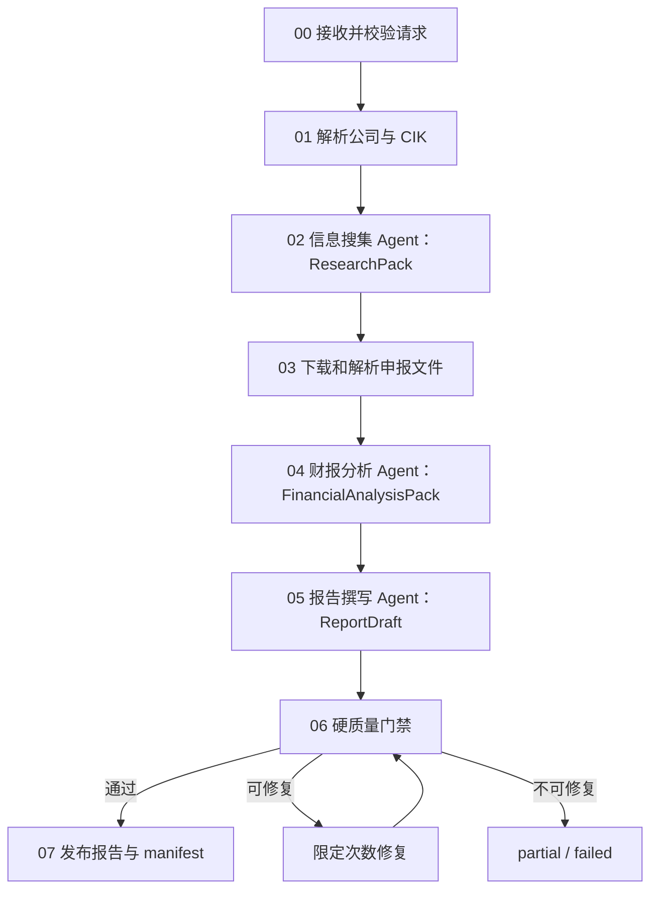
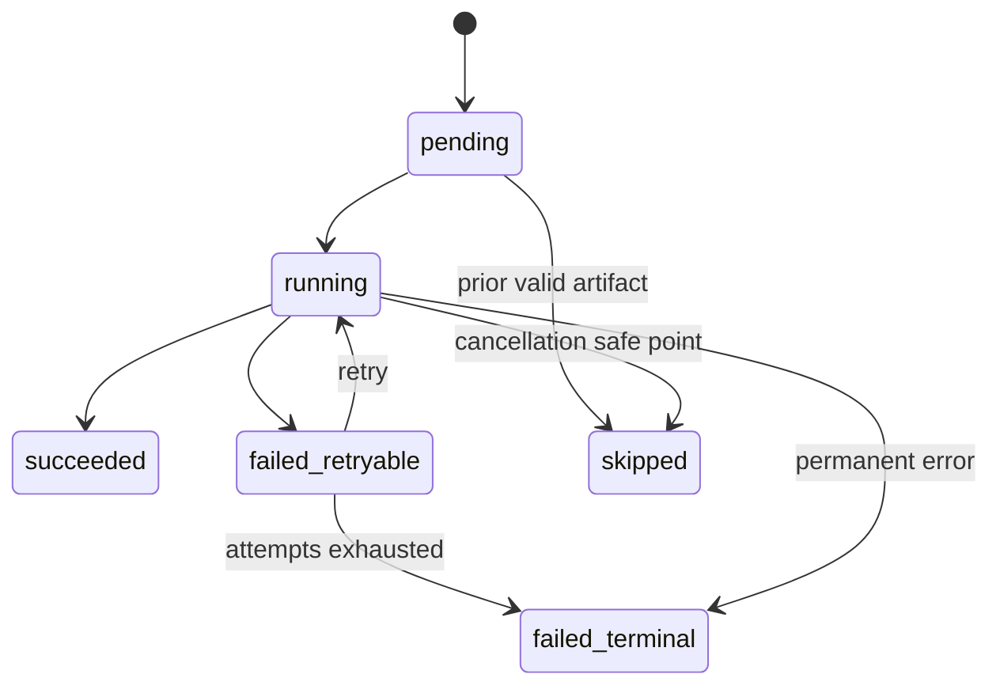

# 工作流、可靠性与评估设计

## 1. 顺序工作流



三项 Agent Task 必须以 `Process.sequential` 执行。外围 CrewAI Flow 负责 00、01、03、06、07 这些确定性步骤，并把每个步骤状态持久化。

## 2. 步骤契约与中间工件

每个步骤只有在“数据库状态成功 + 结构化输出通过 schema + 工件 checksum 写入 manifest”后才算成功。

```text
artifacts/{job_id}/
├── 00_request.json
├── 01_company_identity.json
├── 02_research_pack.json
├── 03_documents_manifest.json
├── documents/
│   ├── {document_id}.html|pdf
│   └── {document_id}.parsed.json
├── 04_financial_analysis_pack.json
├── 04_metrics.json
├── 05_report_draft.json
├── 05_report_draft.md
├── 06_quality_report.json
├── 07_report.md
├── 07_report.pdf                 # P1
└── manifest.json
```

| 步骤 | 输入 | 输出 schema | 硬门禁 |
|---|---|---|---|
| 00 请求校验 | API/CLI payload | `ResearchRequest` | 日期、语言、公司字段有效 |
| 01 公司解析 | `ResearchRequest` | `CompanyIdentity` | CIK 10 位、唯一匹配 |
| 02 信息搜集 | identity、as-of | `ResearchPack` | SEC 来源齐全、URL 去重、无未来数据 |
| 03 文档处理 | source refs | `DocumentManifest` | checksum、类型、解析状态可用 |
| 04 财务分析 | research、facts、docs | `FinancialAnalysisPack` | 指标输入与公式可追溯、单位/期间一致 |
| 05 报告写作 | research + analysis | `ReportDraft` | 必需章节、claim key、citation key 完整 |
| 06 质量检查 | draft + 所有 packs | `QualityReport` | schema、数字、引用、声明全部通过 |
| 07 发布 | validated draft | `RunManifest` | 工件存在、checksum 一致、状态原子提交 |

## 2.5 受控反思与修订闭环（Phase 3.5 补充）

主流程仍是：Research → Analysis → Writer → **Quality Gate**。
升级点：质量门禁不再只输出一个布尔，而是输出**结构化质量问题（QualityIssue）列表**，
由受控路由（ReflectionController，P03-20）决定下一步唯一动作（不直接调 Agent）。

### 路由决策（确定性）

| 结构化问题 | 动作 | 下游 | 次数上限 | 终止条件 |
|---|---|---|---|---|
| 无问题 | PUBLISH | 07 发布 RunManifest | — | 发布 |
| 仅非关键警告 | PUBLISH_PARTIAL | 07 发布（partial） | — | 发布（带警告） |
| 章节/表述/免责声明等可修复 | REVISE_REPORT → Writer 定向修订 | 重新 Writer → 再跑质量门禁 | **修订 ≤1 次** | 修订后通过则发布；仍失败→REJECT |
| 缺少关键证据 | SUPPLEMENT_RESEARCH → 补证请求 | Research 补证一次 → 重新 Analysis → 重写 Writer → 再跑质量门禁 | **补证 ≤1 次** | 补证后通过则发布；仍缺→REJECT |
| 数字篡改 / 关键引用仍缺失 / 不可修复 / 次数耗尽 | REJECT | 终止，任务 partial/failed | — | 拒绝 |

### 核心规则

1. **Agent 不得互相调用**：所有返回与循环由 Flow + ReflectionController 控制（对齐 ADR-001）。
2. **反思有界**：Writer 修订最多 1 次；补充研究最多 1 次。schema 格式重试与业务修订分别计数（格式重试见 guardrail P03-09，业务反思计数见 P03-20）。
3. **不允许无限循环**：任何路径的请求总数受 `max_revision=1, max_supplement=1` 硬上限。
4. **定向修订**：Writer 只修改被 QualityIssue 指出的问题；不得新增上游不存在的事实；不得修改 FinancialFact / MetricResult。
5. **证据缺失不得猜测**：缺少证据必须删除结论或请求补证，不能编造。
6. **每次产物保留**：每次报告草稿、质量报告、修订/补证请求及其原因都作为工件/结构化记录保留（供审计与 RunManifest）。
7. **Quality Gate 仍是确定性代码**：不增加第四个"审核 Agent"。
8. **fake 测试不调用真实模型**：P03-21 纯 fake 覆盖发布/修订/补证/拒绝四条路径。

### 数据结构（P03-16 实现，详见该任务）

- `QualitySeverity`：WARNING / ERROR / CRITICAL
- `QualityAction`：NONE / REVISE_REPORT / SUPPLEMENT_RESEARCH / REANALYZE / REJECT
- `QualityRecommendation`：PUBLISH / PUBLISH_PARTIAL / REVISE / REJECT
- `QualityIssue`：code、severity、stage、message、action、related_claim、citation_key
- `RevisionRequest`：issues、revision_number、original_draft_version、allowed_actions、forbidden_actions
- `SupplementResearchRequest`：missing_evidence、related_claim、required_source_type、as_of_date、attempt_number

> 字段取舍见 P03-16 任务；此处仅给最小契约。

## 3. 任务状态机



Job 状态规则：

- 所有 P0 步骤成功：`succeeded`。
- 报告可以安全发布但带非关键来源缺失警告：`partial`。
- 任一关键步骤 terminal failure：`failed`。
- 用户请求取消并到达安全点：`cancelled`。
- Worker 崩溃后超过 lease 的 `running` 步骤由恢复任务标记为 retryable，再次入队。

## 4. 错误分类与策略

| 类别 | 示例 | 重试 | 最终行为 |
|---|---|---|---|
| `INPUT_INVALID` | 空公司名、未来 as-of | 否 | 422，任务不入队 |
| `COMPANY_AMBIGUOUS` | 同名公司多个 CIK | 否 | 返回候选，等待用户选择 |
| `AUTH_ERROR` | 搜索/LLM key 无效 | 否 | terminal，提示配置 |
| `RATE_LIMITED` | SEC/搜索/LLM 429 | 是 | 遵循 Retry-After + 指数退避 |
| `NETWORK_TRANSIENT` | timeout、DNS、连接重置 | 是 | 指数退避加抖动 |
| `UPSTREAM_5XX` | 第三方 5xx | 是 | 达上限后降级或 terminal |
| `DOCUMENT_UNSUPPORTED` | 加密/损坏 PDF | 仅换解析器 | HTML/备用附件；否则 partial/failed |
| `SCHEMA_INVALID` | LLM 非法结构化输出 | 是，限定修复 | guardrail 反馈后重试，必要时备用模型 |
| `DATA_AMBIGUOUS` | 单位、期间、concept 冲突 | 否自动猜测 | 指标 ambiguous，报告披露限制 |
| `QUALITY_GATE_FAILED` | 引用缺失、数字不一致 | 限定修复 | 仍失败则 rejected/partial |
| `INTERNAL_BUG` | 未预期异常 | 否盲重试 | 保存 trace，terminal，进入缺陷队列 |

## 5. 重试、限流和降级

### 5.1 推荐默认值

- 连接超时 5 秒，读取超时按工具设置 20–90 秒。
- SEC 最大 5 请求/秒作为项目安全上限，低于官方当前 10 请求/秒上限；使用全局 token bucket。
- 网络/429/5xx：最多 4 次尝试，等待 `1s, 2s, 4s, 8s` 上限 30 秒并加抖动；优先尊重 `Retry-After`。
- LLM schema 修复：最多 2 次 guardrail 修复；第三次切备用模型一次。
- PDF 解析：主解析器一次，备用解析器一次，不对同一损坏文件循环重试。
- Job 级重试不重新运行已通过 checksum 和 schema 验证的步骤。

参数最终放在配置文件中，测试不得依赖真实等待时间；通过注入 clock/sleep 模拟。

### 5.2 SEC 合规

- 每个请求发送包含应用名、版本和联系邮箱的 `User-Agent`。
- 使用缓存与条件请求，避免重复下载。
- 永不并发突破项目限速；收到 429 后降低速率并记录指标。
- MVP 使用无需 API key 的 `data.sec.gov` public submissions/XBRL 数据，不混淆为 EDGAR filer submission API。

### 5.3 降级顺序

- 搜索：主提供商 → 备用提供商（P2）→ 仅 SEC/公司 IR，并在报告中声明新闻覆盖有限。
- 申报正文：SEC HTML/iXBRL → PDF/文本附件 → Company Facts only。
- 文档解析：Docling → PyMuPDF/BeautifulSoup → 标记 unsupported。
- LLM：主模型 → 缩小上下文和格式修复 → 备用模型 → terminal。
- 工件存储：本地临时写入、flush 和 checksum 任一步骤失败都不能宣布成功；失败工件必须清理或保留为可识别的临时文件。

## 6. 幂等与断点续跑

- 创建任务接受客户端 `Idempotency-Key`。同 key、同 payload 返回原 job；同 key、不同 payload 返回冲突。
- 步骤幂等键为 `job_id + step_name + input_hash + schema_version`。
- 工具幂等键包含 canonical request；缓存结果仍写一条 `cached` 调用记录。
- 所有工件先写入同一文件系统内的临时文件，完成 flush 和 checksum 后再原子 rename。
- 恢复时从步骤表读取首个非成功步骤，并验证前序工件 checksum，不能只相信状态字段。
- 提示词、模型、公式或 schema 版本变化后，input hash 改变，相关下游步骤必须失效重算。

## 7. 质量门禁

### 7.1 硬门禁

- 所有 Pydantic schema 通过。
- 公司身份和数据截止日一致。
- 报告必需章节和风险声明存在。
- 每个关键数字存在 `fact_id` 或 `metric_id`。
- 每个派生指标的输入、单位、期间和公式版本完整。
- 外部事实 claim 至少有一个可解析 source；来源访问时间不晚于任务生成时间。
- 报告内数字与结构化 pack 在规范化精度下完全一致。
- 不出现目标价、确定性收益承诺或无来源的投资建议。

### 7.2 软评分

- 来源覆盖度、来源新鲜度、SEC/官方来源占比。
- 报告章节完整度和重复度。
- LLM-as-judge 的清晰度/连贯度只能作为辅助指标，不决定数值正确性。
- 人工评分：可读性、洞察价值、复核耗时、需修改比例。

## 8. 可观测性

### 8.1 日志字段

`timestamp`、`level`、`event`、`job_id`、`step_name`、`tool_name`、`attempt`、`trace_id`、`duration_ms`、`error_code`。禁止记录密钥、完整 Authorization 和未截断原文。

### 8.2 指标

- `research_jobs_total{status}`
- `research_job_duration_seconds`
- `workflow_steps_total{step,status}`
- `workflow_step_duration_seconds{step}`
- `tool_calls_total{tool,status}`
- `tool_call_duration_seconds{tool}`
- `tool_retries_total{tool,error_code}`
- `cache_hits_total{cache}` / `cache_misses_total{cache}`
- `llm_tokens_total{agent,direction}`
- `quality_gate_failures_total{gate}`
- `stale_running_steps`

不要给 `job_id`、URL 或公司名做 Prometheus label，避免高基数。

## 9. 测试金字塔

| 层 | 内容 | 是否调用真实外部服务 |
|---|---|---|
| 单元测试 | 公式、期间选择、错误分类、状态机、schema、URL 清理 | 否 |
| 契约测试 | 每个工具对固定响应 fixture 的解析 | 否 |
| 集成测试 | PostgreSQL、Redis、工件原子写入、恢复执行 | 本地容器 |
| 录制回放 | SEC/搜索响应快照，验证上游格式变化 | 录制时是，CI 否 |
| E2E smoke | 1 家固定公司完整工作流 | 可配置真服务 |
| 基准评估 | 20 公司 × 5 场景 | 是，记录版本与时间 |
| 故障注入 | timeout、429、5xx、坏 PDF、非法 JSON、Worker 中断 | Mock/本地 |

## 10. 95% 成功率评估报告模板

每次基准运行保存：

- 代码 commit、依赖锁 hash、模型和提示词版本。
- 公司、CIK、as-of、场景、开始/结束时间。
- 最终状态、失败步骤、错误类别和重试次数。
- 质量门禁结果、人工复核结果、Token 与外部 API 次数。

汇总必须同时报告总体成功率、每步骤成功率、P50/P95 时延、重试后恢复率和失败类别分布。只有总体成功次数至少 96/100 且硬质量门禁无绕过，才可在简历写“任务成功率 >95%”。
